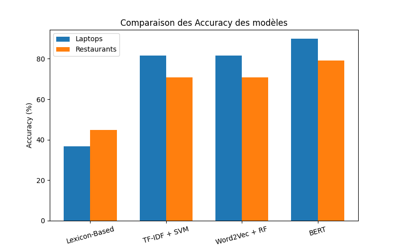
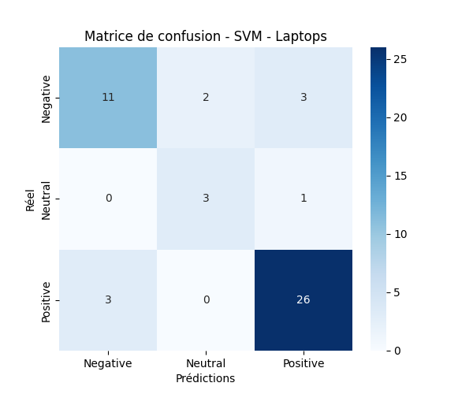
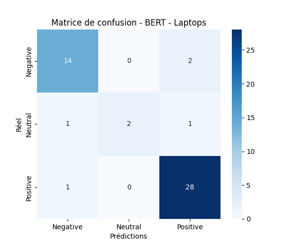
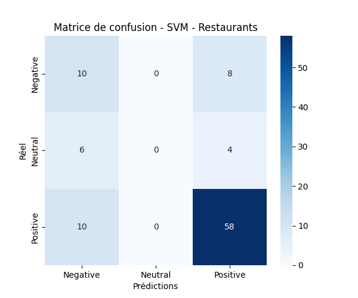
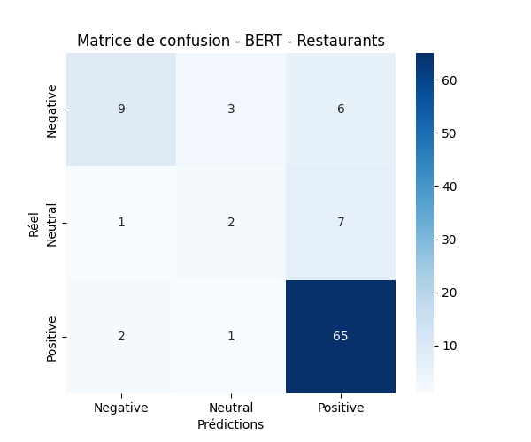

# **Analyse de Sentiment Basée sur l'Aspect (ABSA) : Comparaison des Approches**

## **Description du projet**
Ce projet vise à analyser les sentiments associés à des aspects spécifiques dans des avis clients (évaluations de produits et de restaurants). Nous avons mis en œuvre différentes approches, allant des méthodes lexicon-based aux modèles d'apprentissage automatique et deep learning.

## **Structure du projet**
```
TP-SA/
│── data/                     # Dossiers contenant les fichiers XML d'entraînement et de test
│── models/                   # Modèles enregistrés (SVM, RF, Word2Vec, BERT...)
│── notebooks/                # Jupyter notebooks pour l'analyse exploratoire et l'entraînement
│── results/                  # Prédictions enregistrées des différents modèles
│── src/                      # Scripts Python pour l'entraînement, la prédiction et l'évaluation
│── README.md                 # Ce fichier de documentation
│── requirements.txt           # Liste des dépendances nécessaires
│── .gitignore                 # Fichiers à exclure du versionnement Git
```

## **Approches et Comparaison des Modèles**
Nous avons testé plusieurs approches pour l'ABSA :

| **Modèle**          | **Description** | **Accuracy (Laptops)** | **Accuracy (Restaurants)** |
|-----------------|------------------------------------------------------------|----------------------|------------------------|
| Lexicon-Based  | Utilisation d'un dictionnaire de mots positifs/négatifs | 36.7%               | 44.8%                  |
| SVM (TF-IDF)   | Machine Learning avec SVM et TF-IDF pour la représentation du texte | 81.6%               | 70.8%                  |
| Random Forest (Word2Vec) | Word2Vec pour vectoriser les textes et Random Forest pour classifier | 81.6%               | 70.8%                  |
| BERT (Deep Learning) | Fine-tuning de BERT pour l'ABSA | 89.8%               | 79.2%                  |

**Conclusion :** BERT offre la meilleure précision, mais au coût d'un temps de calcul plus important.

## **Installation et Utilisation**
### **1. Cloner le projet et installer les dépendances**
```bash
git clone git@github.com:Hamdaoui1/Analyse_Sentiment.git
cd Analyse_Sentiment
pip install -r requirements.txt
```

### **2. Entraînement des modèles**
- **Lexicon-Based :**
  ```bash
  python src/lexicon_sentiment.py
  ```
- **SVM & RF :**
  ```bash
  python src/train_model.py
  ```
- **Word2Vec :**
  ```bash
  python src/word2vec_model.py
  ```
- **BERT :**
  ```bash
  python src/train_bert.py
  ```

### **3. Prédiction sur de nouvelles données**
- **Lexicon-Based :**
  ```bash
  python src/lexicon_sentiment.py
  ```
- **SVM & RF :**
  ```bash
  python src/predict.py
  ```
- **BERT :**
  ```bash
  python src/predict_bert.py
  ```

### **4. Évaluation des Modèles**
- **Lexicon-Based :**
  ```bash
  python src/evaluate_lexicon.py
  ```
- **SVM, RF et Word2Vec :**
  ```bash
  python src/evaluation.py
  ```
- **BERT :**
  ```bash
  python src/evaluate_bert.py
  ```

### **5. Visualisation des Résultats**
```bash
python src/visualization.py
```

### **6. Résultats et Comparaisons des Modèles**
#### **Comparaison des Accuracy des modèles**


#### **Matrices de Confusion**
##### **SVM - Laptops**


##### **BERT - Laptops**


##### **SVM - Restaurants**


##### **BERT - Restaurants**


## **Points Améliorables**
- Améliorer l'approche lexicon-based avec des ressources plus riches.
- Expérimenter d'autres architectures de deep learning.
- Tester BERT avec d'autres jeux de données et d'autres techniques de fine-tuning.

## **Auteur**
- Hamdaoui1

**N'hésite pas à contribuer et proposer des idées d'amélioration !**

